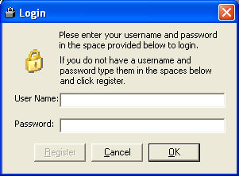



## A\_Login

### Description

A simple example of making a login for a program using ADO with an Access database. Also allows you to register new usernames and passwords. This program could be improved upon by adding a Primary Key to the database and a few others. I just wanted a simple login so I didn't take the time to put in any extras.
 
### More Info
 

             |
---                |---
**Submitted On**   |2005-06-29 10:02:52
**By**             |[Jason McGill](https://github.com/Planet-Source-Code/PSCIndex/blob/master/ByAuthor/jason-mcgill.md)
**Level**          |Beginner
**User Rating**    |5.0 (15 globes from 3 users)
**Compatibility**  |VB 6\.0
**Category**       |[Databases/ Data Access/ DAO/ ADO](https://github.com/Planet-Source-Code/PSCIndex/blob/master/ByCategory/databases-data-access-dao-ado__1-6.md)
**World**          |[Visual Basic](https://github.com/Planet-Source-Code/PSCIndex/blob/master/ByWorld/visual-basic.md)
**Archive File**   |[A\_Login190774712005\.zip](https://github.com/Planet-Source-Code/jason-mcgill-a-login__1-61441/archive/master.zip)

